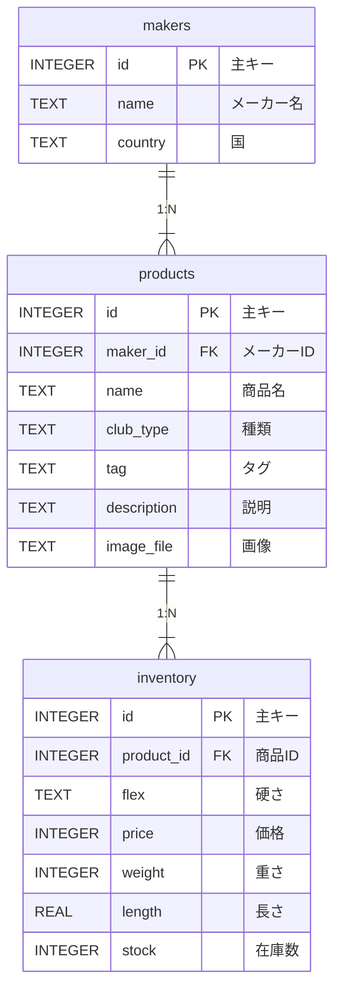

# データベース設計書

以下は `reset_data.sql` に基づくER図です。

```mermaid
erDiagram
    %% 1. メーカーテーブル
    makers {
        INTEGER id PK "主キー"
        TEXT name "メーカー名"
        TEXT country "国"
    }

    %% 2. 商品テーブル
    products {
        INTEGER id PK "主キー"
        INTEGER maker_id FK "メーカーID"
        TEXT name "商品名"
        TEXT club_type "種類"
        TEXT tag "タグ"
        TEXT description "説明"
        TEXT image_file "画像"
    }

    %% 3. 在庫・スペックテーブル
    inventory {
        INTEGER id PK "主キー"
        INTEGER product_id FK "商品ID"
        TEXT flex "硬さ"
        INTEGER price "価格"
        INTEGER weight "重さ"
        REAL length "長さ"
        INTEGER stock "在庫数"
    }

    %% 関係線
    makers ||--|{ products : "1:N"
    products ||--|{ inventory : "1:N"
```
