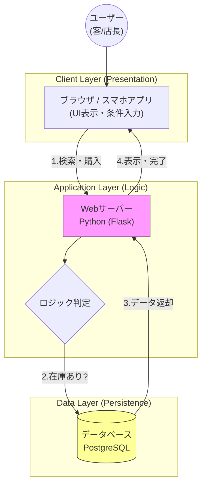

# システム構成図 (System Architecture)

Web 3層構造（Client, App Server, Database）を採用し、在庫管理システムと連動する構成としました。

## 非機能要件 (Non-functional Requirements)
- **Performance:** 検索結果は1秒以内に表示すること。
- **Backup:** 1日1回、深夜にDBのバックアップを自動取得する。
- **RPO (目標復旧時点):** 障害発生時は最大24時間前までのデータ復旧を保証する。
